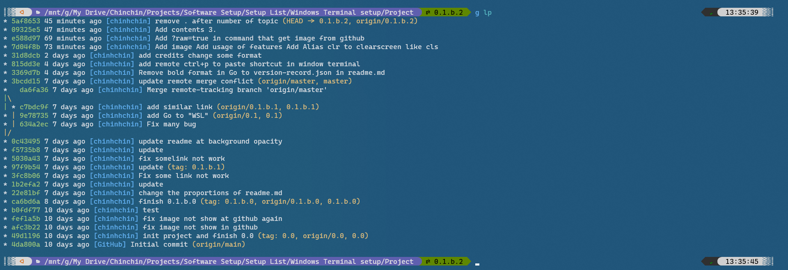
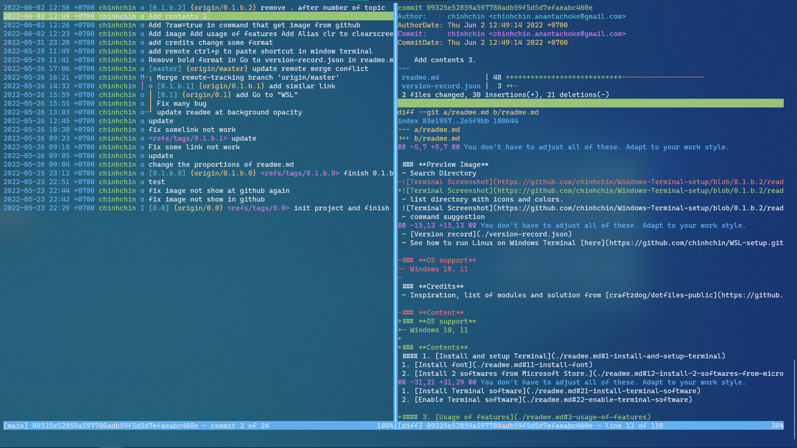

# **My Git setup**
This is my git setup for get more productivity and speed in git workflow.
Hope you canget something on this repository

### **Image Preview**
- git log pretty shortcut

- tig - git gui


### **Go to**
- [Version Record](./version-record.json)

### **Credits**
- Inspiration, list of modules and solution from [craftzdog/dotfiles-public](https://github.com/craftzdog/dotfiles-public).

### **OS support**
- Windows
- Windows (WSL)
- Linux
- macOS

### **Contents**
#### **1. [aliases (shortcuts) in Git](./readme.md#1-aliases-shortcuts-in-git)**
1. [Open .gitconfig file](./readme.md#11-open-gitconfig-file)
2. [Add alias to .gitconfig file](./readme.md#12-add-alias-to-gitconfig-file)
3. [Usage](./readme.md#13-usage)

#### **2. [Tig](./readme.md#2-tig)**
1. [Install Tig](./readme.md#21-install-tig)
2. [Usage](./readme.md#22-usage)

---

## **1. aliases (shortcuts) in Git**
### **1.1 Open .gitconfig file**
```
vim ~/.gitconfig
```

### **1.2 Add config to .gitconfig file**
Copy this command and append to file that you open in [1.1](./readme.md#11-open-gitconfig-file)
```
[core]
        editor = nvim
[alias]
        i = init
        a = add
        aa = add .

        st = status

        ci = commit
        cim = commit -m

        lp = log --pretty=format:\"%Cgreen%h %Creset%cd %Cblue[%cn] %Creset%s%C(yellow)%d%C(reset)\" --graph --date=relative --decorate --all
        llog = log --graph --name-status --pretty=format:\"%C(red)%h %C(reset)(%cd) %C(green)%an %Creset%s %C(yellow)%d%Creset\" --date=relative

        br = branch
        bra = branch -a
        co = checkout
        cob = checkout -b

        find = "!f() { git log --pretty=format:\"%h %cd [%cn] %s%d\" --date=relative -S'pretty' -S\"$@\" | peco | awk '{print $1}' | xargs -I {} git diff {}^ {}; }; f"

        rao = remote add origin

        pa = push --all
        pt = push --tags

[diff]
        tool = nvimdiff

```

### **1.3 Usage**
You can add or see what alias that can use from this
```
[alias]
    <alias> = <full command>
```

## **2. Tig**
### **2.1. Install Tig**

```
brew install tig
```

> **Note**
>
> If you don't have Brew, you can get installation tutorial from this [chinhchin/Fish-Shell-setup](https://github.com/chinhchin/Fish-Shell-setup/blob/master/readme.md#14-install-brew).

### **2.2. Usage**

You can find usage solution by go to directory that have repository then type "*Tig*" and press "*h*"
